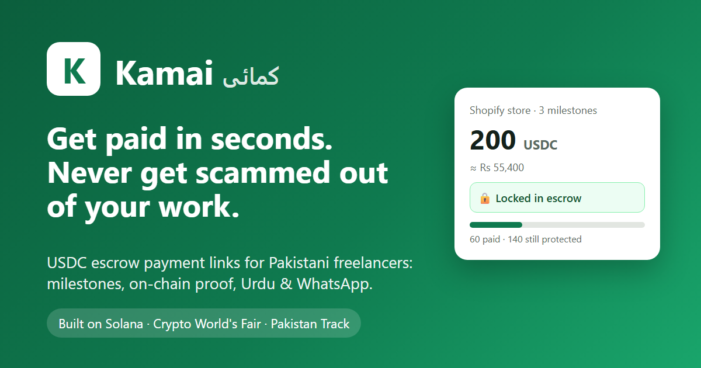
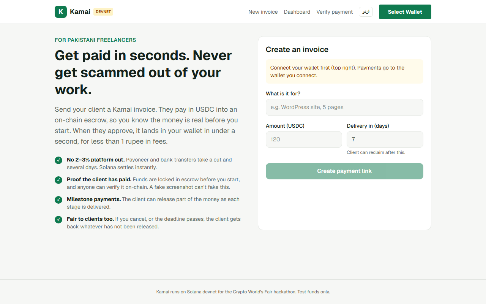
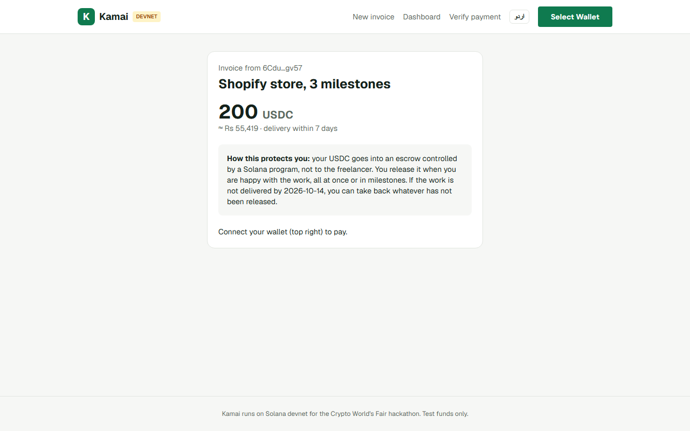
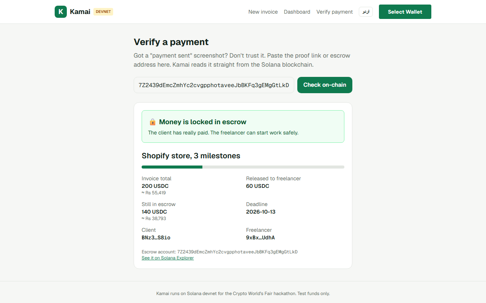
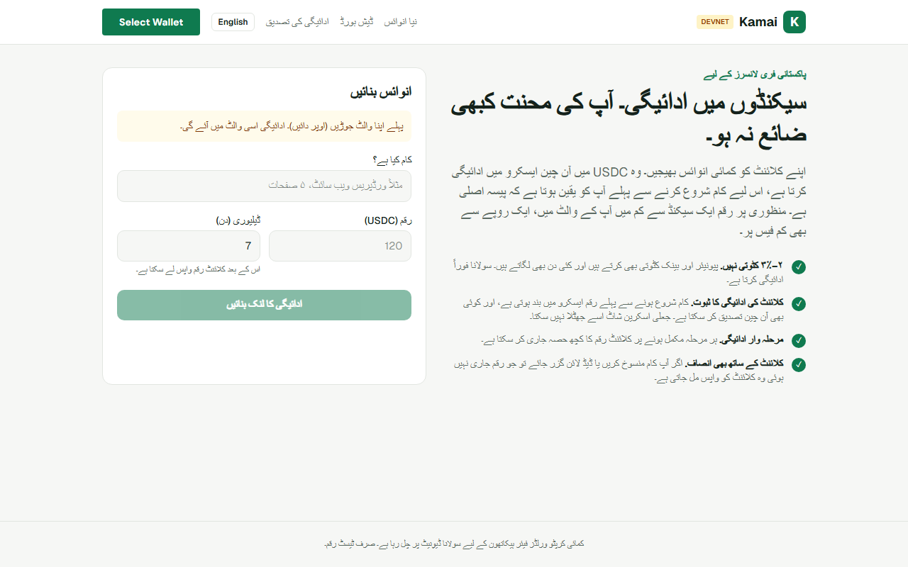

<p align="center"></p>

<p align="center">
  <a href="https://nasir17086.github.io/kamai/"><b>🌐 Live app (devnet)</b></a> ·
  <a href="https://youtu.be/bz8M_5BsK7w"><b>▶ 80-sec demo</b></a> ·
  <a href="https://youtu.be/8dwq74mJ3A4"><b>🎤 Pitch</b></a> ·
  <a href="https://nasir17086.github.io/kamai/verify/?e=7Z2439dEmcZmhYc2cvgpphotaveeJbBKFq3gEMgGtLkD"><b>🔒 Live on-chain proof</b></a> ·
  <a href="https://explorer.solana.com/address/61ZkAfTG1tNYA2sDwsKDFCG8MBQRaYWfkRqzfXtos6Zd?cluster=devnet"><b>⛓ Program</b></a>
</p>

<p align="center">
  
  
  
  
  
</p>

# Kamai: get paid safely in USDC

**Escrow payment links for Pakistani freelancers, on Solana.**

## Why Kamai is different

| | Payoneer / bank wire | Freelance platforms | Plain crypto transfer | **Kamai** |
|---|---|---|---|---|
| Fees | 2–3%+ | 10–20% | < $0.01 | **< $0.01** |
| Arrives in | 2–5 days | days, after a clearance period | seconds | **< 1 second** |
| Client protected if work isn't delivered | ✗ | ✓ | ✗ | **✓ automatic refund after the deadline** |
| Freelancer can prove the client really paid | ✗ | partly | ✗ | **✓ public on-chain proof page** |
| Pay per milestone | ✗ | ✓ | ✗ | **✓ partial releases on-chain** |
| Urdu interface + WhatsApp sharing | ✗ | ✗ | ✗ | **✓** |
| Who holds the money | a company | a company | nobody (no protection) | **an open-source Solana program** |

## Screenshots

| Create an invoice (QR + WhatsApp) | Client pays into escrow |
|---|---|
|  |  |
| **Public on-chain proof: 60 paid, 140 still locked** | **Full Urdu (right-to-left) interface** |
|  |  |

*Kamai* (کمائی) means "earnings" in Urdu.

Pakistan has one of the world's largest freelance workforces. Getting paid is still the hardest part of the job:

- **Slow and expensive.** Payoneer, bank wires and platform withdrawals take 2–3%+ in fees and 2–5 days to arrive.
- **Scams.** Direct clients (WhatsApp, Facebook groups, LinkedIn) often vanish after delivery, or send fake "payment sent" screenshots.
- **No trust in either direction.** Freelancers want the money up front, and clients don't want to pay before the work is done.

Kamai fixes this with a payment link backed by an on-chain escrow:

1. The **freelancer** connects a wallet, types what the job is, the amount in USDC and the delivery days, and gets a **payment link + QR code** to send on WhatsApp or email.
2. The **client** opens the link and pays. The USDC goes into an **escrow account owned by the Kamai program**, not to the freelancer. Both sides can see on-chain that the money is real and locked.
3. When the work is delivered, the client clicks **Release**: either all of it, or part of it per **milestone**. The freelancer gets paid in under a second, for a fraction of a cent in fees.
4. If the freelancer **cancels**, or the **deadline passes**, the client takes back **whatever has not been released**. No admin, and nobody in the middle holding funds.
5. **Verify, don't trust screenshots.** Every escrow has a public proof link (`/verify/?e=<escrow>`) that reads its state straight from Solana: locked, partly paid, released or refunded. That ends the "fake payment screenshot" scam.

The whole app works in **Urdu (right-to-left) and English**. Invoices can be shared on **WhatsApp** in one tap, which is how Pakistani freelancers actually talk to clients.

No sign-up and no custody. The only middleman is ~200 lines of open-source Rust.

## How it works

```
 Freelancer                    Client                       Kamai program (Solana)
     | create invoice link        |                                   |
     |--------------------------->|                                   |
     |                            |  fund(id, amount, deadline, title)|
     |                            |---------------------------------->|  escrow PDA + USDC vault
     |                            |  release(amount)  (milestones)    |
     |                            |---------------------------------->|  vault -> freelancer
     |  cancel = refund()         |       or, after deadline: refund()|  vault -> client
     |------------------------------------------------------------------>|
```

- **Escrow PDA** seeds: `["escrow", client, freelancer, invoice_id]`. It stores the client, freelancer, mint, amount, released so far, deadline, status and title.
- **Vault**: the escrow PDA's associated token account. It is closed on settlement, and its rent goes back to the client.
- **Rules enforced on-chain:**
  - only the client can `release`, any amount up to what is left (milestones), and releasing the remainder completes the invoice;
  - the freelancer can `refund` at any time (cancel), which returns only the unreleased remainder;
  - the client can `refund` only after the deadline;
  - an invoice can be funded only once;
  - the amount must be greater than 0, the deadline must be in the future, and the title must be ≤ 64 bytes.
- Uses `token_interface`, so it works with SPL Token and Token-2022 stablecoins (USDC, PYUSD…).

The invoice itself is just a URL (`/pay/?to=…&amt=…&t=…&id=…&due=…`), so there's no database and no backend. The app is a static Next.js site, and everything else lives on Solana.

## Repo layout

| Path | What |
|---|---|
| `program-src/lib.rs` | Anchor program (`fund`, `release`, `refund`) |
| `web/` | Next.js app: create invoice (QR + WhatsApp), pay page, dashboard (milestone release / refund / cancel), public `/verify` proof page, Urdu/English, PKR estimates |
| `web/scripts/e2e.mjs` | End-to-end test against a live validator (18 checks) |
| `web/src/idl/` | Generated IDL + TypeScript types |
| `scripts/` | WSL helpers: workspace setup, local validator + deploy |

## Run it

Toolchain: Rust 1.89, Solana CLI 3.1, Anchor 1.1.2, Node 20+.

```bash
# program (Anchor workspace)
anchor build
solana-test-validator --reset &        # or use devnet
anchor deploy --provider.cluster localnet

# end-to-end tests (18 checks: fund, release, milestones, auth, double-fund, cancel, deadline refund, validation)
cd web && npm install
node scripts/e2e.mjs http://127.0.0.1:8899

# web app
NEXT_PUBLIC_RPC_URL=http://127.0.0.1:8899 npm run dev     # or omit for devnet
npm run build                                             # static export in web/out/
```

On devnet, the app uses Circle's devnet USDC (`4zMMC9srt5Ri5X14GAgXhaHii3GnPAEERYPJgZJDncDU`). You can get free test USDC at [faucet.circle.com](https://faucet.circle.com).

**Program ID:** `61ZkAfTG1tNYA2sDwsKDFCG8MBQRaYWfkRqzfXtos6Zd`

## Test results

```
PASS  fund moves 100 USDC into vault
PASS  escrow stores title/amount/status
PASS  freelancer cannot release
PASS  release pays freelancer 100
PASS  status = Released
PASS  cannot fund same invoice twice
PASS  client cannot refund before deadline
PASS  freelancer cancel refunds client
PASS  cannot release after refund
PASS  client reclaims after deadline
PASS  milestone 1 pays 30, stays in escrow
PASS  cannot release more than remaining
PASS  cannot release zero
PASS  cancel after milestones refunds only the remaining 20
PASS  final milestone completes invoice
PASS  zero amount rejected
PASS  past deadline rejected
PASS  long title rejected

18 passed, 0 failed
```

## Roadmap

- **Dispute window** with an optional third-party arbiter both sides agree on.
- **PKR off-ramp**: partner with local exchanges and licensed EMIs (for example via Raast) so freelancers can cash out to a bank or wallet.
- **WhatsApp bot**: create and share invoices without opening the app.
- **Solana Pay QR** so clients can pay straight from a mobile wallet.
- **Reputation**: on-chain history of completed invoices as a portable freelancer CV.

## Team

Built in Pakistan for Colosseum's Crypto World's Fair and the Superteam Pakistan Track.
